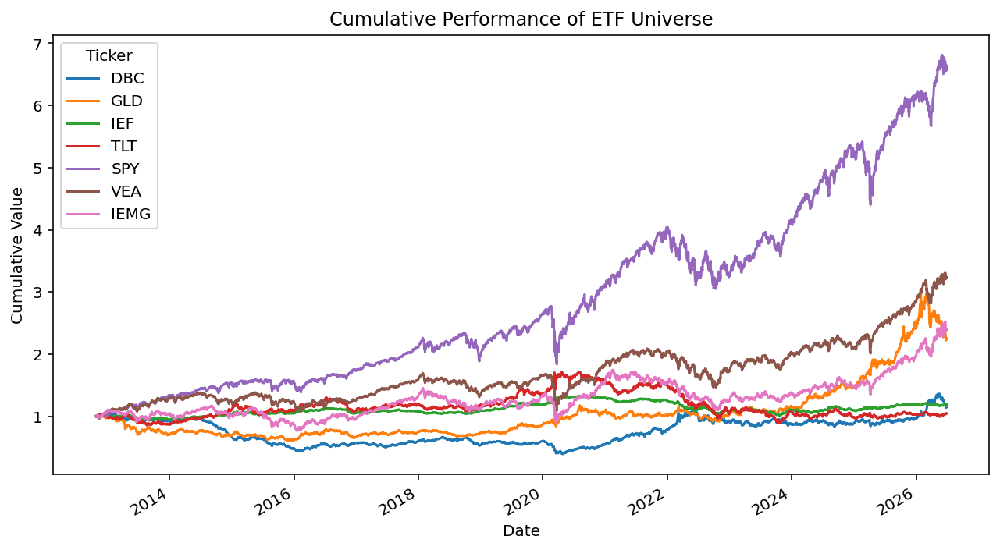
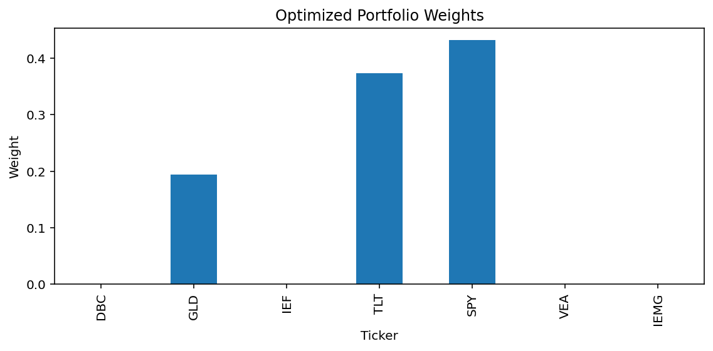
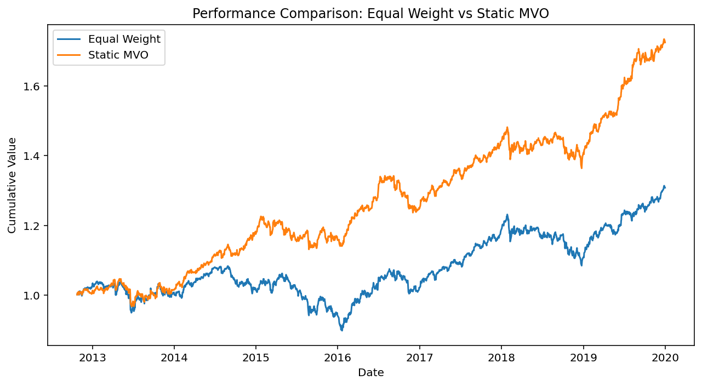
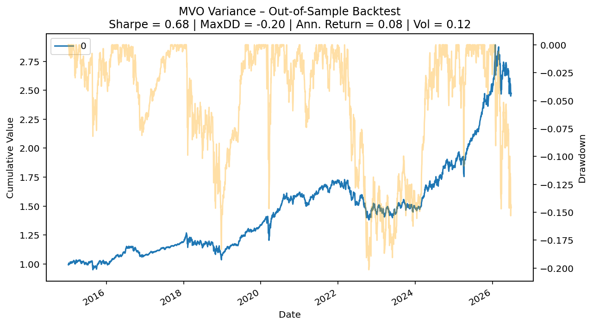
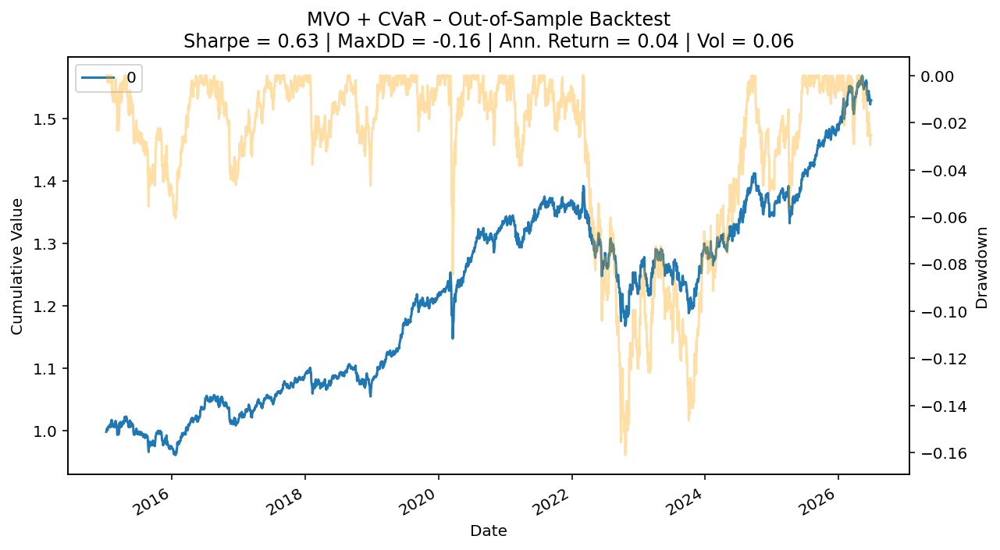
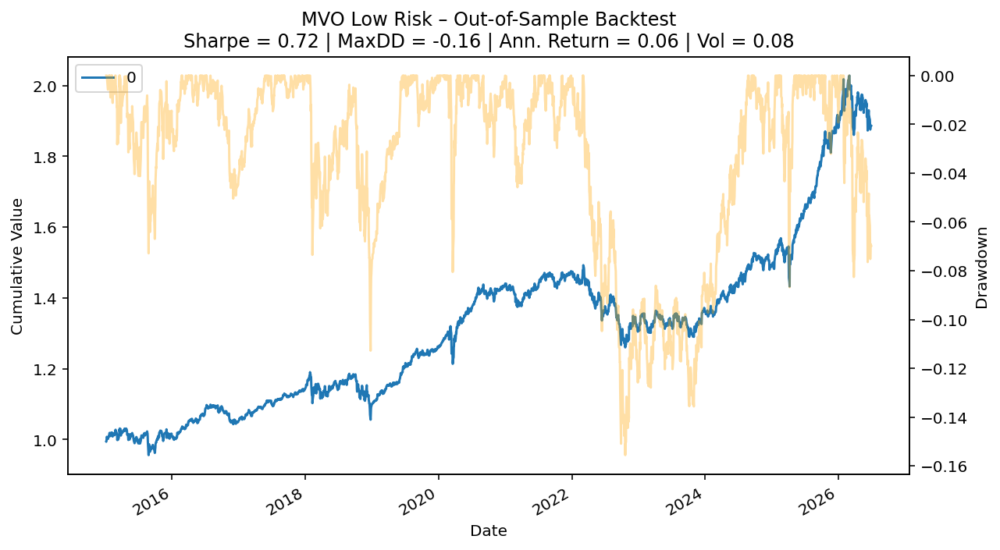

# Portfolio Optimization and Backtesting

Python implementation of constrained portfolio optimization and annual rebalancing backtesting using a diversified ETF universe.

The project compares different mean-variance portfolio optimization approaches under realistic investment constraints and evaluates their out-of-sample performance.

---

## Project Overview

This project implements a quantitative asset allocation framework based on Modern Portfolio Theory using convex optimization.

The workflow consists of:

- Downloading historical ETF prices from Yahoo Finance
- Computing daily returns
- Building an equally weighted benchmark
- Solving constrained Mean-Variance Optimization (MVO)
- Extending MVO with CVaR and low-risk configurations
- Performing annual out-of-sample backtesting
- Comparing portfolio performance and risk metrics

The optimization problem is solved using **CVXPY**.

---

## ETF Universe

The investment universe includes seven liquid ETFs representing different asset classes.

| ETF | Asset Class |
|------|-------------|
| SPY | US Equities |
| VEA | Developed International Equities |
| IEMG | Emerging Markets |
| GLD | Gold |
| DBC | Commodities |
| IEF | Intermediate US Treasuries |
| TLT | Long-Term US Treasuries |

---

## Optimization Constraints

The optimizer includes realistic portfolio constraints:

- Fully invested portfolio
- Long-only allocation
- No short selling
- Maximum leverage constraint
- Portfolio concentration constraint (L2 norm)
- Annual rebalancing

Different optimization objectives are tested:

- Mean-Variance Optimization
- Mean-Variance + CVaR
- Low-Risk Mean-Variance Optimization

---

## Performance Metrics

Portfolio performance is evaluated using:

- Annualized Return
- Annualized Volatility
- Sharpe Ratio
- Maximum Drawdown

Both in-sample and out-of-sample results are reported.

---

# Results

## ETF Universe



---

## Static Mean-Variance Optimization

The optimized portfolio allocates capital primarily toward the assets with the highest historical risk-adjusted returns while respecting investment constraints.



---

## In-Sample Comparison

Static optimized portfolio compared against an equally weighted benchmark.



---

## Out-of-Sample Backtests

### Mean-Variance Optimization



### Mean-Variance + CVaR



### Low Risk Optimization



---

## Technologies

- Python
- NumPy
- Pandas
- Matplotlib
- CVXPY
- yfinance

---

## Installation

```bash
pip install -r requirements.txt
```

---

## Run

```bash
python portfolio_optimization.py
```

---

## Future Improvements

Possible extensions include:

- Black-Litterman allocation
- Risk parity portfolios
- Transaction costs
- Rolling covariance estimation
- Robust optimization
- Bayesian expected returns
- Multi-factor portfolio construction

---

## License

MIT License
